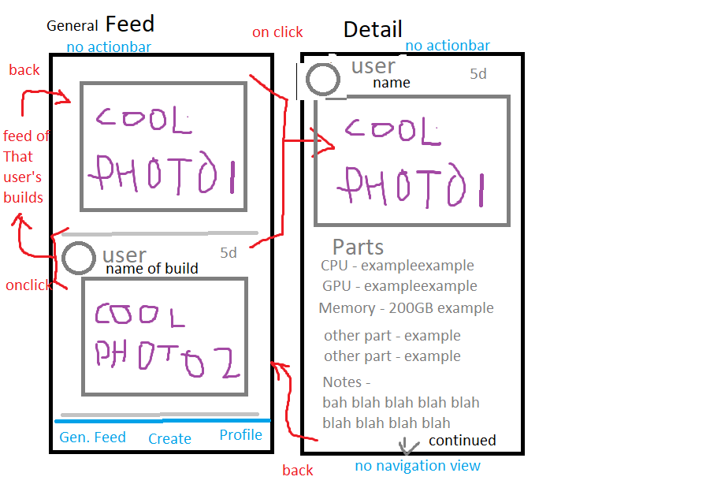
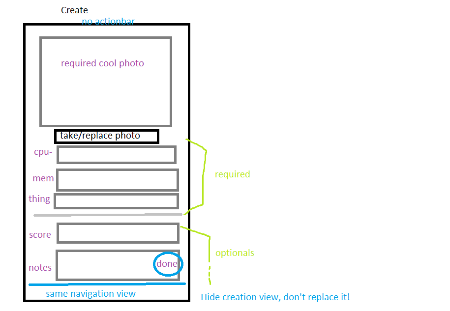
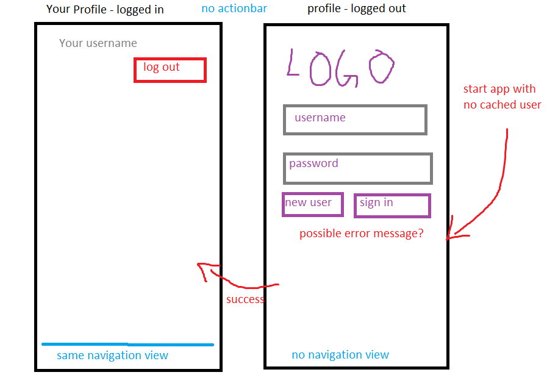

# PC Presenter

## Contributors 
 - Me (Aaron Wang)
 
 That's it? Pod 11 people, if you want in then message me on slack or something...

## Table of Contents
1. [Overview](#Overview)
1. [Product Spec](#Product-Spec)
1. [Wireframes](#Wireframes)
2. [Schema](#Schema)

## Overview
### Description
Show off your computer builds of all sorts to the world. Include component lists and any notes about special customizations.
Backed by Parse.

## Product Spec

### 1. User Stories (Required and Optional)

**Required Must-have Stories**
- [x] User can sign up and log in to / log out from the service
- [x] User can create a listing detailing parts used in their personal computer ("Rig") and upload it 
   - [x] User can give a name to each Rig
   - [ ] User can attach benchmark scores to each Rig to indicate expected performance
   - [x] User can add a photo and explanatory notes
   - [ ] User can update this listing later if it changes or delete it
- [ ] User can browse the server's list of Rigs by their photos

**Optional Nice-to-have Stories**

- [ ] User can access a webpage to buy specific parts they see (from Amazon, etc.)
- [ ] User can see all of a specific user's Rigs, including their own

### 2. Screen Archetypes

* The Feed
   * Browse recently added rig photos from everyone OR a specific user
* The Detail
   * See all the added details of a rig
* The Creation screen
   * Fill out details of your new rig, add a photo, and submit
* The Profile screen 
   * Manage login/logout, profile picture

### 3. Navigation

**Tab Navigation** (Tab to Screen)

* Feed (everyone)
* Creation
* Profile

**Flow Navigation** (Screen to Screen)

* Feed (everyone)
   * Click a rig's photo to go to its detail
   * Click a username of profile picture to go to feed of their builds
* Feed (specific user)
   * Same for getting to build detail
   * Clicking a username does nothing
   * feed navigation button goes back to general feed
* Detail
   * Back goes to preceding feed screen
* Creation
   * only navigation button goes anywhere
* Profile
   * successful login/logout switches state of this screen
   * only navigation button goes anywhere

## Walkthroughs / Progress
Build 1

## Wireframes

## Schema 
[This section will be completed in Unit 9]
### Models
Rig - Includes required fields (cpu, photo, etc.) and variable optional key-value fields (special notes, specific benchmark scores, etc.)

### Networking
- Backed by Parse:
   - Uses a Parse Rig class to store relevant information
   - Uses the Parse User class to store users' authentication 
